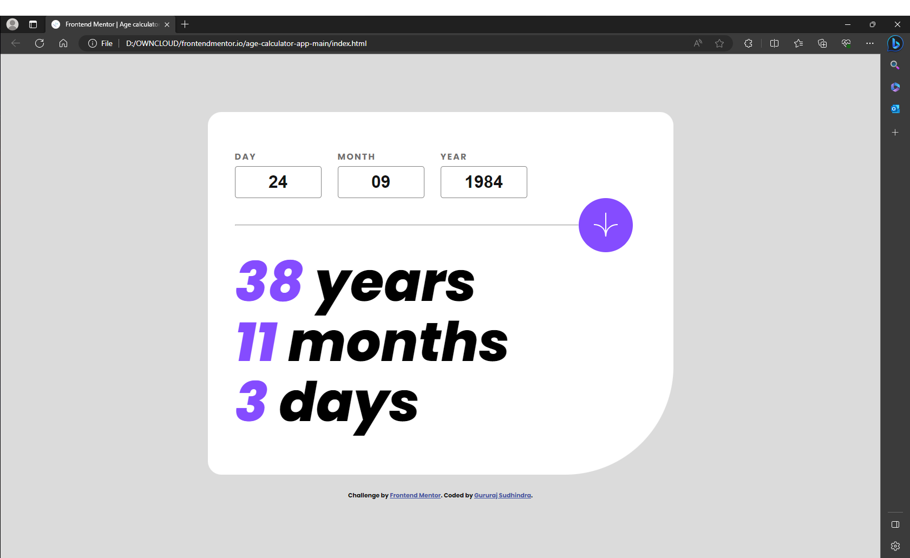

# Frontend Mentor - Age calculator app solution

This is a solution to the [Age calculator app challenge on Frontend Mentor](https://www.frontendmentor.io/challenges/age-calculator-app-dF9DFFpj-Q). Frontend Mentor challenges help you improve your coding skills by building realistic projects.

## Table of contents

- [The challenge](#the-challenge)

- [Screenshot](#screenshot)

- [Links](#links)

- [My process](#my-process)

- [Built with](#built-with)

- [Continued development](#continued-development)

- [Useful resources](#useful-resources)

- [Author](#author)

### The challenge

Users should be able to:

- View an age in years, months, and days after submitting a valid date through the form

- Receive validation errors if:

- Any field is empty when the form is submitted

- The day number is not between 1-31

- The month number is not between 1-12

- The year is in the future

- The date is invalid e.g. 31/04/1991 (there are 30 days in April)

- View the optimal layout for the interface depending on their device's screen size

- See hover and focus states for all interactive elements on the page

- **Bonus**: See the age numbers animate to their final number when the form is submitted (coming in v3)
- **Bonus**: See a confetti effect when the user’s birthdate matches the current date.(v2)
- **Bonus**: See a "Happy Birthday" animated text when the user’s birthdate matches the current date.(v2)

### Screenshot

### Links

- Solution URL: [Solution](https://github.com/SG75/ageCalculator)

- Live Site URL: [Live Site](https://age-calculator-ashy-phi.vercel.app/)

## My process

### Built with

- Semantic HTML5 markup

- CSS custom properties

- Flexbox

- JavaScript for DOM manipulation and animations.

### Continued development

next version of this app will have the following featrures

1. animated display for age,month and days (coming in v3)
2. greeting "Happy Birthday" when the current date and month matches the user input
3. Confetti effect when the user's birthdate matches the current date.

### Useful resources

- This [resource ](https://shorturl.at/kAM01) helped me to calcualte the leap year
- This [resource ](https://github.com/catdad/canvas-confetti) JavaScript Confetti Library was used for the confetti effect.

## Author

- Frontend Mentor - [@sg75](https://www.frontendmentor.io/profile/sg75)
